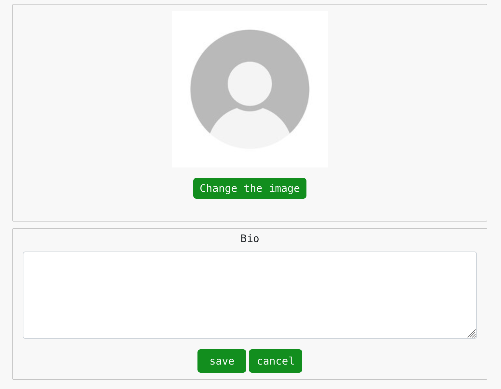

# rem-frontend

***Deployment***

Update with this in axiosDefault.js:
* axios.defaults.baseURL = "http://localhost:8000";

# remember-backend
The project Rem application is project for me to learn as much as I can about developing a modern web application. The backend functionality is built on Django using Django REST Framework with a Postgres SQL database. The frontend React application uses the React library Axios to connect with the Api. Issues in Github is used to handle what features to build and prioritise according to the MoSCoW method in structured way. The purpos for this application is to collect code snippets and other information that is good to reuse in some way when coding.

The live link for the frontend (Web application) can be found here - [https://remember-backend-ff8df02164f2.herokuapp.com/](https://remember-frontend-b9e629f40656.herokuapp.com/)  
The live link for the backend (Web API) can be found here - [https://remember-backend-ff8df02164f2.herokuapp.com/
](https://remember-backend-ff8df02164f2.herokuapp.com/)  

Connect to https://remember-backend-ff8df02164f2.herokuapp.com/| Site should open with message "Welcome to my drf API!" 

### Font:
Menlo Regular Generated from: http://www.cufonfonts.com

    AaBbCcDdEeFfGgHhŞşIıİi Example

### Color-scheme:

Color scheme:

Dark| Dark green|Middle green|Bright green|Grey|White
----|-----------|------------|------------|----|-----
(#0D0208)|(#003B00)|(#008F11)|(#00FF41)|(#C6C6C6)|(#F8F8F8) 

### Wireframes:

### React Libries:
Following libraries has been used:
	-axios: "^0.21.4",
    -bootstrap": "^4.6.0",
    -react-bootstrap": "^1.6.3",
    -react-highlight": "^0.15.0",
    -react-infinite-scroll-component": "^6.1.0",
    -react-router-dom": "^5.3.0",
    -react-scripts": "^4.0.3",
    -react-syntax-highlighter": "^15.5.0",

# Reused objects
    ### Api (Django)
    * Permission.py
    ### Frontend (React)
    * NotesPage Component List View
# Testing

Steps | Expected result | Actual Results | Pass / Fail
------------- | ------------- | ------------- | -------------
|||| As expected | Pass 
Append uri /profiles | List profiles data | As expected| Pass
Append uri /profiles/2| Fetch profile by id | As expected| Pass
Append uri /profiles/66| Error message: "HTTP 404 Not Found" "detail": "Not found."  | As expected| Pass
Login| Django REST framework login page should open | As expected| Pass
Login as Sam| Form to update Sam's own profile should open | As expected| Pass
Logout| Form to update Sam's own profile should not open | As expected| Pass
Append uri /posts | List posts data | As expected| Pass
Append uri /posts/2| Fetch post by id| As expected| Pass
Append uri /comments| Fetch comments | As expected| Pass

# Bugs
 * A CORS problem with wrong settings in config vars Heroku. -Fixed.
 * Profile name in navbar is not set to active color. -Not fixed.

# Deployment

The REM app is deployed on Heroku cloud service from Github repository rem-front https://rem-front-378d7413a299.herokuapp.com/ . It is connected to an backend api https://rem-backend-api-933e70f9f3d2.herokuapp.com/
A Postgres database on ElephantSQL cloud service is used and static files is handled by cloud service Cloudinary.

Steps to deploy:

* Heroku:
* Fork this repository to your own github repository.
* Create a new app.
* Connect to your forked repository and deploy.

Local:
* Clone your forked repository to local pc.
* In terminal go to app folder and run command "npm run".

# Credits
Example code and design is used from:
- 

# Media
My photos.

