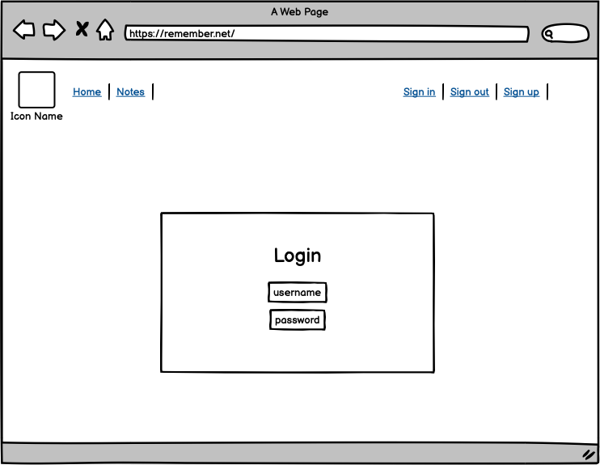

# rem-frontend

REM is a responsive web application created for me and others to make notes about code snippets and other useful command strings. It's possible for anyone to create their own notes and also to pin their own or others' notes. I took inspiration from the movie 'Matrix' for the choice of the color scheme." The backend functionality is built on Django using Django REST Framework with a Postgres SQL database. The frontend is a React application that uses the React library Axios to connect with the Api. Issues in Github rem-frontend repository is used to handle what features to build and prioritise according to the MoSCoW method. 

The live link for the frontend (Web application) can be found here - [https://rem-front-378d7413a299.herokuapp.com/](https://rem-front-378d7413a299.herokuapp.com/)  
The live link for the backend (Web API) can be found here - [https://rem-backend-api-933e70f9f3d2.herokuapp.com/](https://rem-backend-api-933e70f9f3d2.herokuapp.com/)  

## Features:

**Responsive navigation bar:**

**Landing page**

**Note page**

**Sign up page**

## Design

In the design work I took insperation from the the Matrix move and the style of font from how terminal windows looks like. I used the program Balsamiq Wireframes make the scetches of what the pages should be.
Therfore I'm using the font Menlo Regular and the color scheme of different schades of green. My goal is to have good contrast between different objects, text and background and so forth. The app name REM associates with remark (comment out) and remember. 

### Font:

Menlo Regular Generated from: http://www.cufonfonts.com

    AaBbCcDdEeFfGgHhŞşIıİi Example

### Color-scheme:

Color scheme:

Dark| Dark green|Middle green|Bright green|Grey|White
----|-----------|------------|------------|----|-----
(#0D0208)|(#003B00)|(#008F11)|(#00FF41)|(#C6C6C6)|(#F8F8F8)

This makes it possible to use light green on parts with dark background and dark green on part with light background to get high contrasts on text and icons.

### Wireframes:

### Following libraries is used in react:

* axios
* bootstrap
* react-bootstrap
* react-highlight
* react-infinite-scroll-component
* react-router-dom
* react-scripts
* react-syntax-highlighter

### Reused objects in app:

* Note
* CurrentUserContext
* useRedirect
* Asset
* Avantar

### Testing

[Test_images](src/assets/file/TestResultsImages.md)

Example on test protocol:

Steps | Expected result | Actual Results | Pass / Fail 
----- | --------------- | -------------- | ----------- 
Append  https://rem-front-378d7413a299.herokuapp.com | All notes is displayed | As expected | Pass
Click on Login in navbar | Login form is displayed | As expected | Pass
Login without username | Message: Must include username and password | As expected | Pass
Login as Stina| 
Click on username Stina in navigation bar | Form to update Stina's own profile should open | As expected | Pass
Logout | Username Stina should not display in navigation bar | As expected | Pass
Browser reload page | Username Stina should not display in navigation bar | Username Stina is displayed | Fail
Login as Stina and click add notes | Open create note form | As expected | Pass
Add title, description, code snippet and click create | A new note is displayed with highlighted code | As expected| Pass
Click on Pin icon in note| Icon change from gray to green | As expected | Pass
Click on Pins icon in navigation bar | A list of Stinas pinned notes should display | As expected | Pass

# Bugs found so far
 * A CORS problem with wrong settings in config vars Heroku. -Fixed.
 * Profile name in navbar is not set to active color. -Not fixed.
 * Different browsers handles coockies differently which might create authenticating problem. Not fixed

# Deployment

The REM app is deployed on Heroku cloud service from Github repository rem-front https://rem-front-378d7413a299.herokuapp.com/ . It is connected to rem-backend-api https://rem-backend-api-933e70f9f3d2.herokuapp.com/
Backend is build on Django deployed on Heroku, a Postgres database on ElephantSQL cloud service and media files is handled by cloud service Cloudinary.

Steps to deploy:

* Heroku:
* Fork this repository to your own github repository.
* Create a new app.
* Connect to your forked repository and deploy.

Local:
* Clone your forked repository to local pc.
* Start rem-backend from Github repository https://github.com/SamsKod/rem-backend
* Update with this in axiosDefault.js: axios.defaults.baseURL = "http://localhost:8000";
* In terminal go to app folder and run command "npm start".

# Credits
Example code and design is used from:
- Code Institute
- icons8.com
- Font Awesome
- pluralsight.com
- Logrocket.com
- idownloadblog.com
- cufonfonts.com

# Media
My photos.

