# Test results images

***Click on login link in navigation bar, login page opens.***

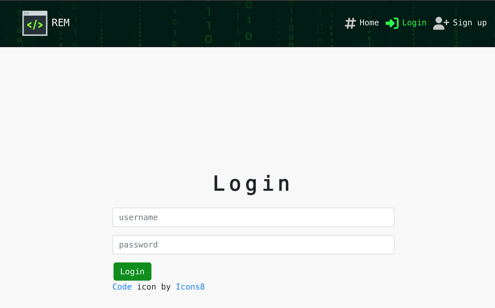

***When username or password is not provided a message appears to the user.***

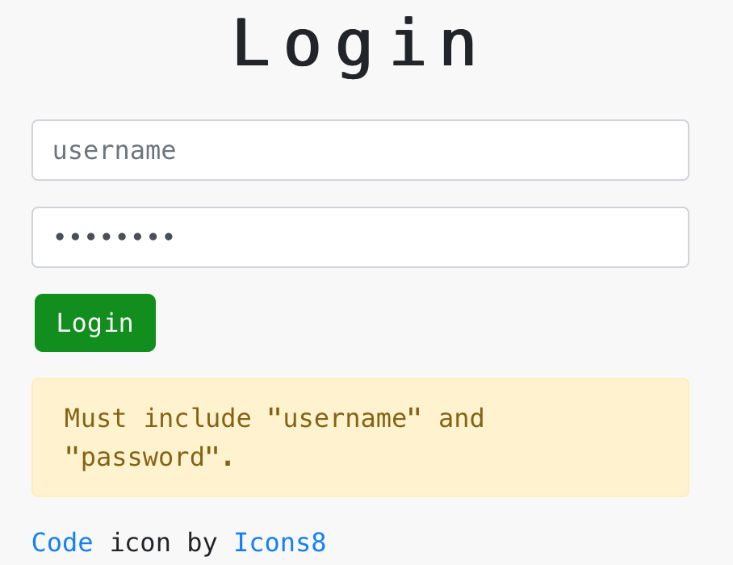

***When user is logged in username and profile image is displayed on the navigation bar.***

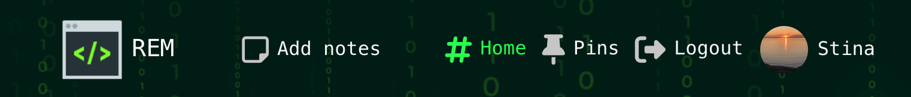

***Click on Add notes in navigation bar, create notes form opens***

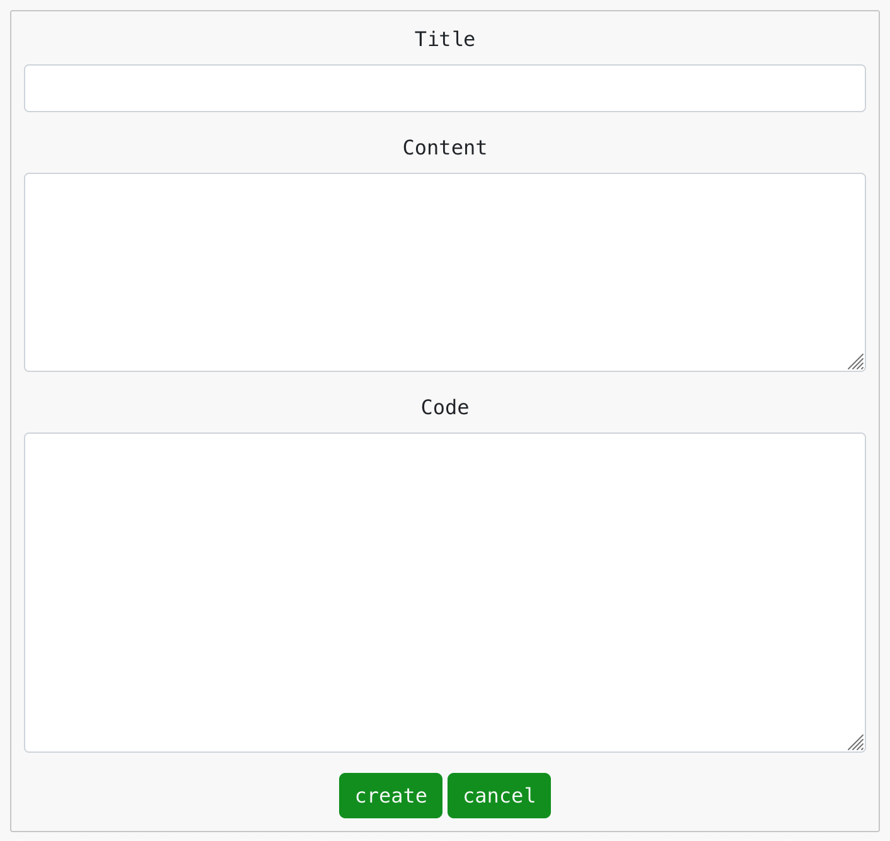

***A logged in user can edit notes by clicking on the three dots in the right corner***

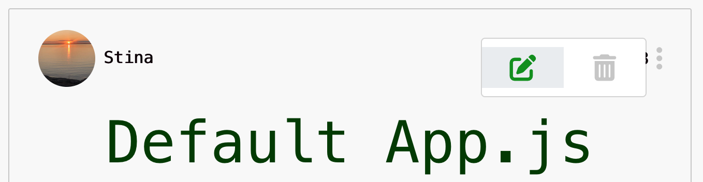

***Click on edit ocon opens notes edit form***

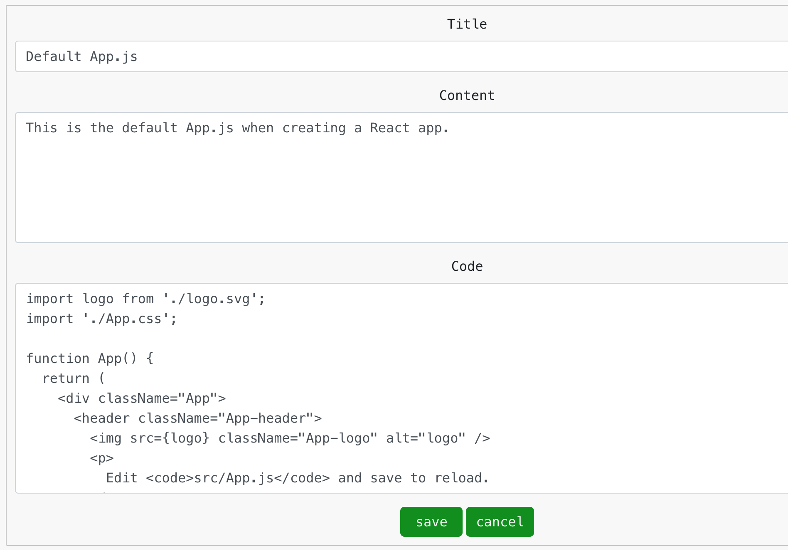

***Click on a pin icon pins the note and icon color change to green***

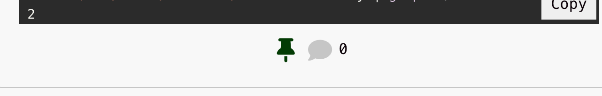

***A message is diplayed if a user tries to pin ocr comment a note and is not logged in***

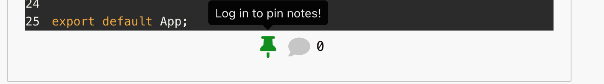

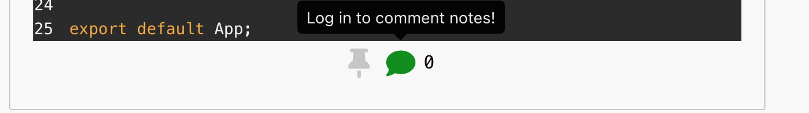

***When logged in click on comment icon to open create comment form***

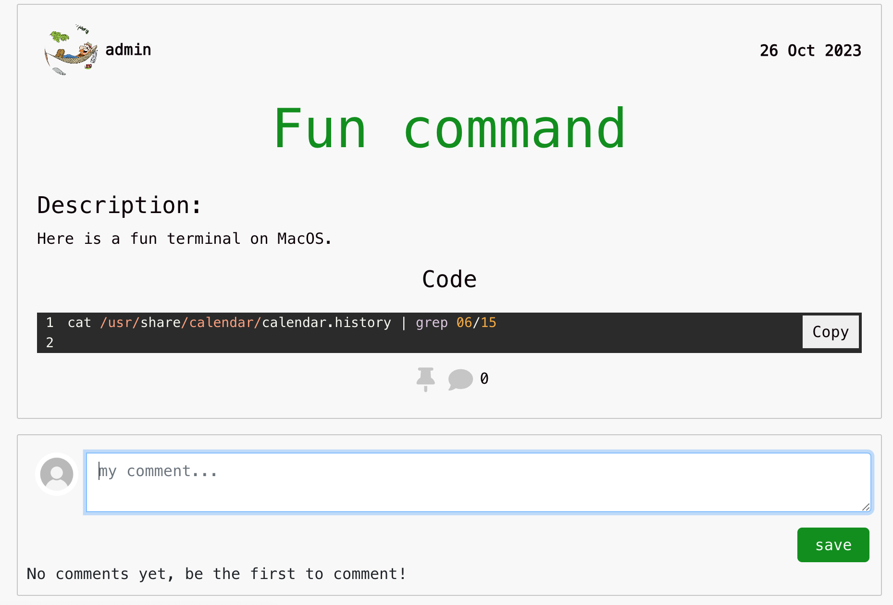

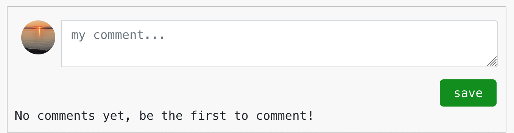

***Click on username or user image in navigation bar to open profile edit form***

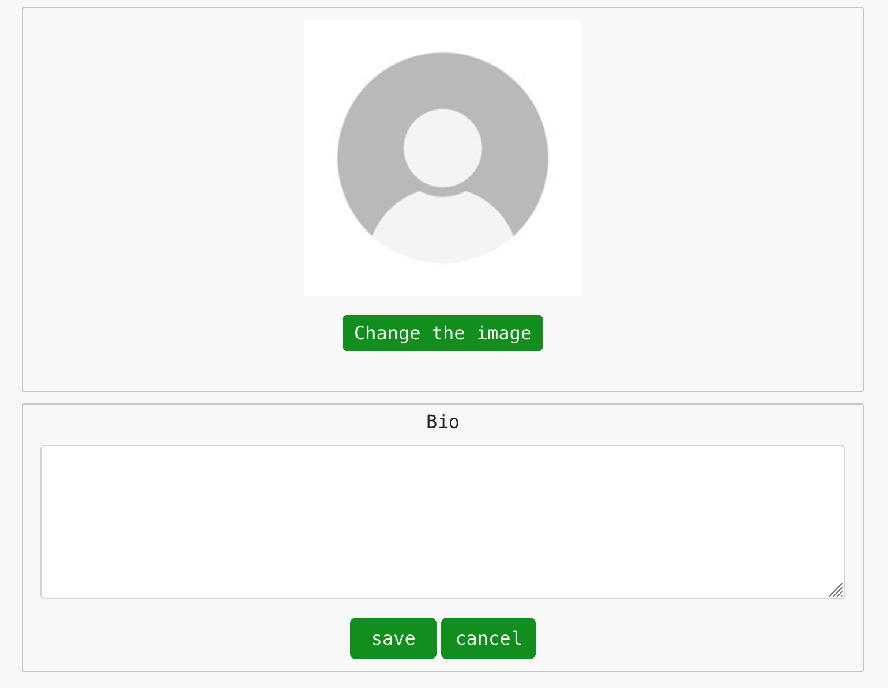

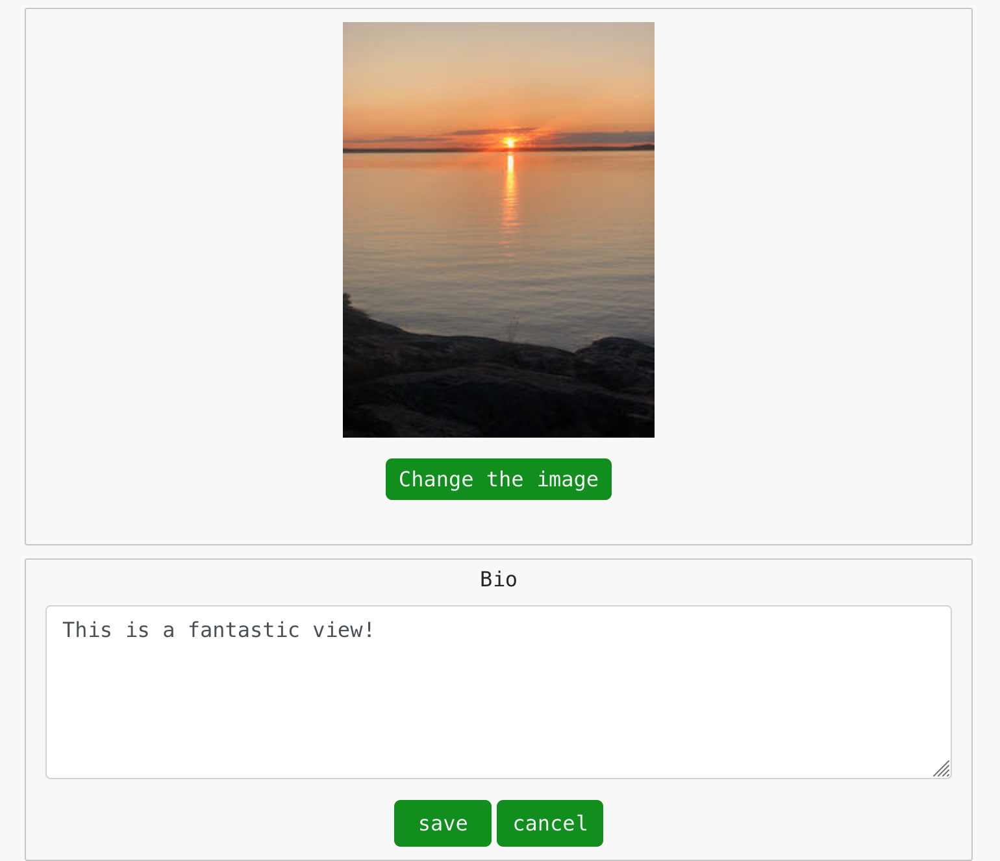

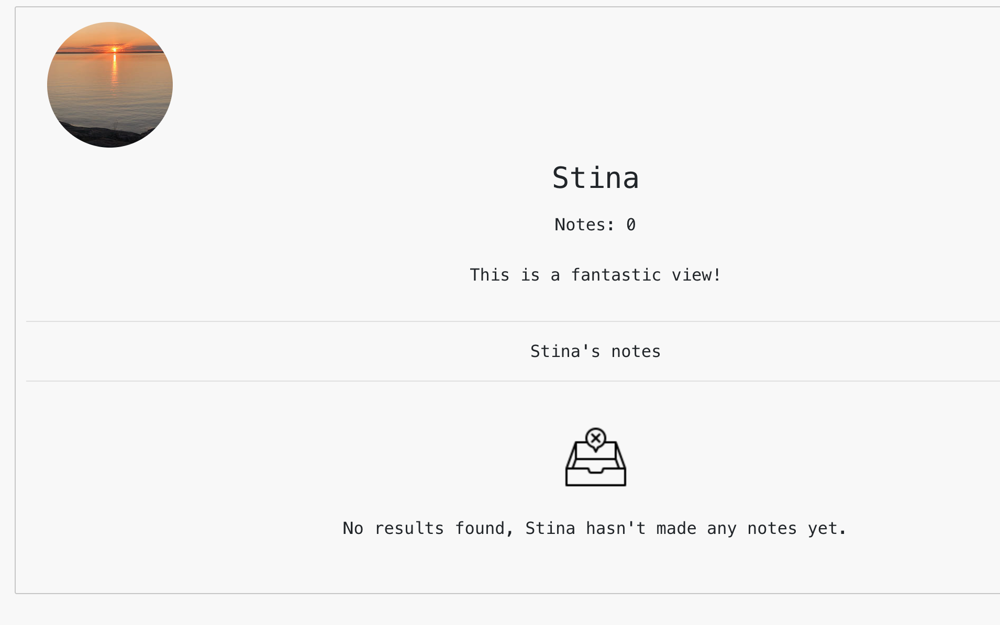

